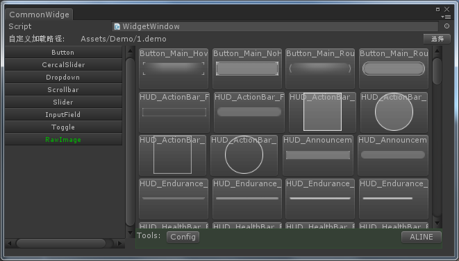
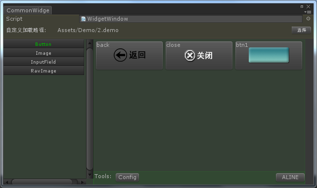
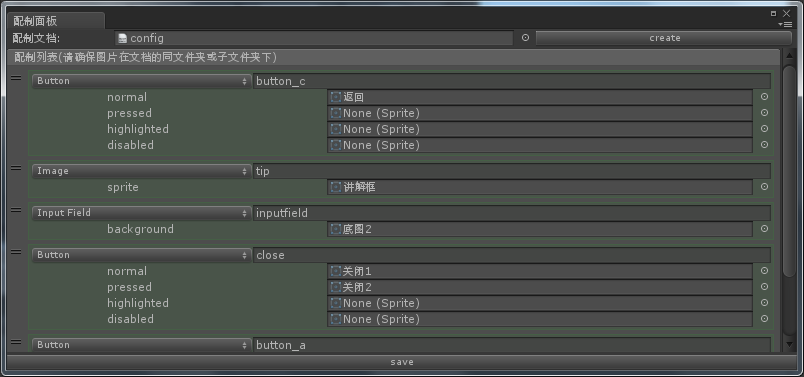

# Common-Widget-UGUI
just like ngui,you can define some widget, preview it and quit Init ,not for big project,but some little demo my need
## Menu Path
  “Window/CommonWidget”
## 1.the window
  
## 2.user define
  
## 2.user config
  